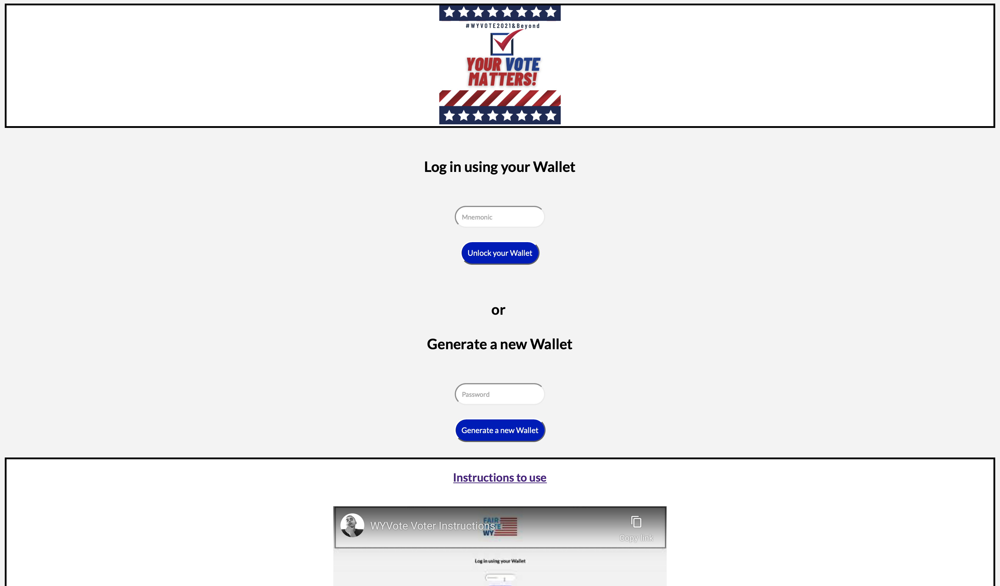
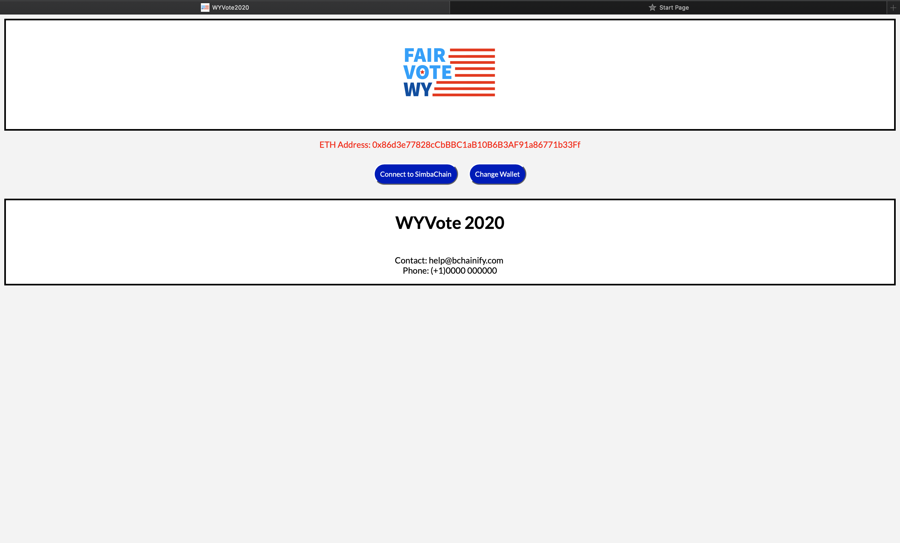
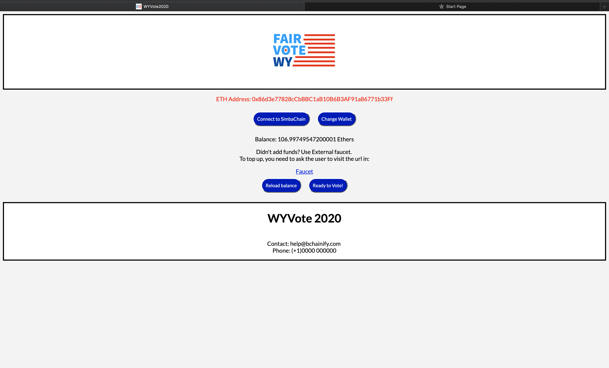
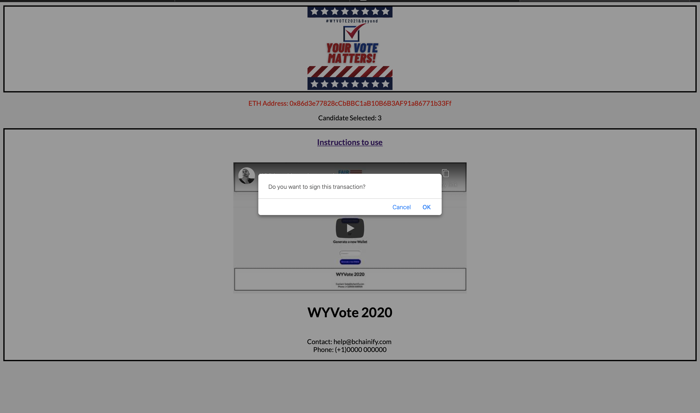
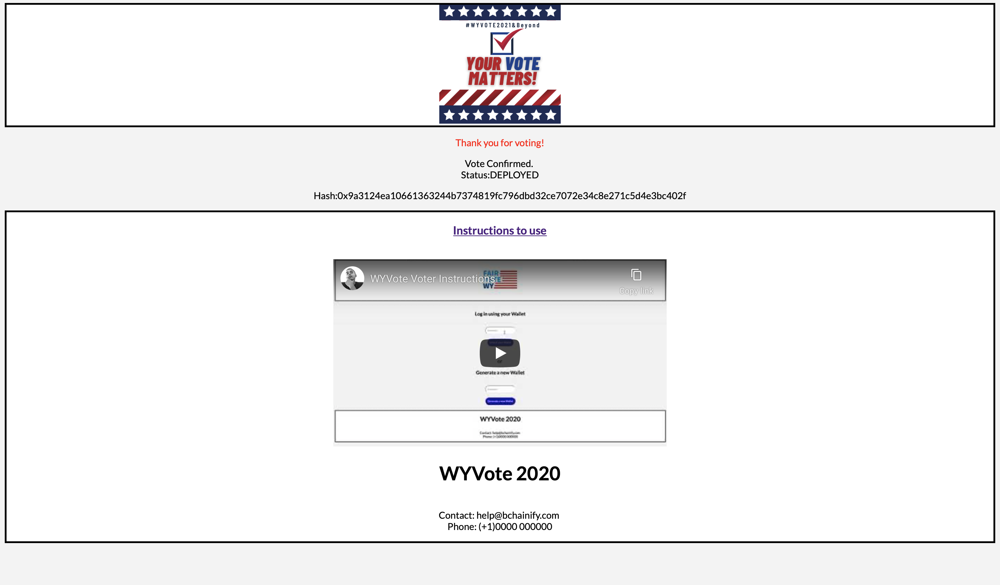

# WYVote2020 Voter Application

### Instructions to use
#### Step 1
The voter will be assigned a mnemonic or wallet address and password after registering for elections.
This is taken as a input to log in.  
- Add the mnemonic in Mnemonics placemholder and press "Unlock your Wallet"
- If you don't have a wallet, click on "Generate a new Wallet" after entering a unique password. This will generate a new wallet with 0 balance. Though vote registered from this wallet will not be taken into considered while counting total votes by the Election Commission as it was not registered earlier. 
##### USE MNEMONIC (with balance) :
blue horn cabin absent rigid chronic field upset weird nephew try rescue
  
Screenshot:
  

#### Step 2
Confirm your ETH Address
- Select to "Go Ahead" once you confirm
- Else select "Change Wallet" and enter your mnemonic again 
  
Screenshot:
  

#### Step 3
Check for funds
- To successfully vote, you need some funds in your wallet (for gas).
- If the balance is 0 ETH, go to [Faucet](https://faucet.rinkeby.io)
- "Reload balance" once you added funds
- Now that you have funds in your wallet, select "Ready to Vote!" 
  
Screenshot:
  

#### Step 4
Vote for the candidate of your choice
#### Step 5
Confirm the candidate that you've voted for on the screen and sign the transaction from the pop-up.
  
Screenshot:
  

#### Step 6
Get the confirmation.
- Note down the hash code 
  
Screenshot:
  

